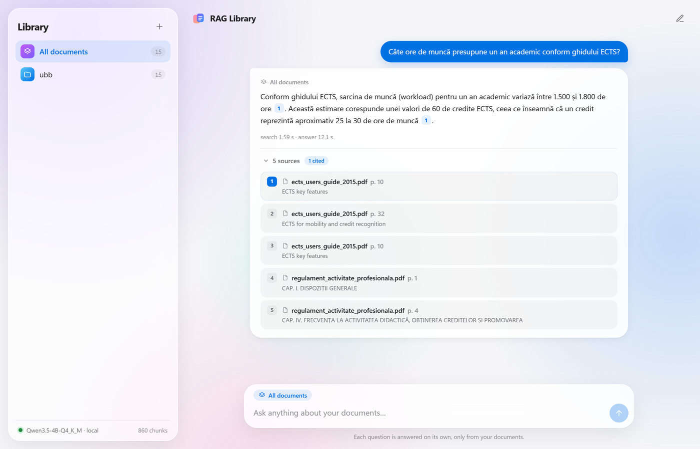
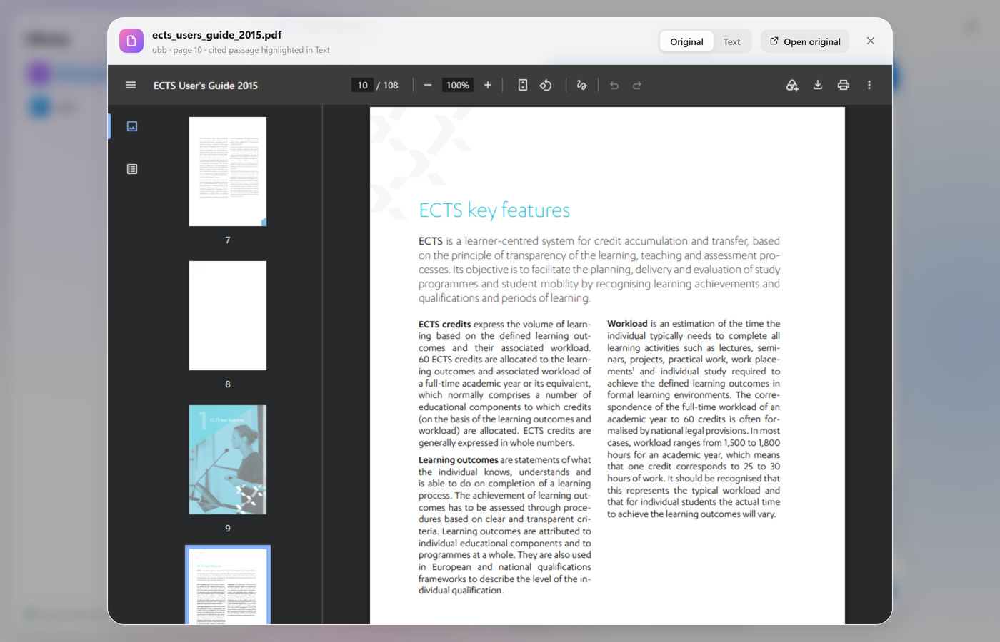

## Project name
Hybrid Search RAG System: question answering over a university's documents, with citations


## Introduction
A local web app that answers questions from a library of documents (regulations, guides,
syllabi, theses) in Romanian and English. You upload files into folders and ask a
question. The app finds the relevant passages and writes a short answer in which every
claim cites its source as `[n]`. When the documents do not contain the answer, it says
so instead of guessing.

Everything runs on one machine, on a CPU, with no external API: retrieval takes about
2 seconds and an answer about 45 seconds on a laptop CPU.

Every component was chosen by measurement on a development set and then checked once on
a held-out test set. The decisions and the numbers behind them are in
[docs/DESIGN.md](docs/DESIGN.md).



*A question in Romanian answered from an English document. Every claim cites a numbered
source; the cited one is highlighted.*



*Each source opens the original document at the cited page.*

## How a question is answered

```
                         ┌─ dense search (multilingual-e5-base, Qdrant) ─┐
question ── per language ┤                                               ├─ RRF fusion ─ 20 candidates
                         └─ keyword search (BM25, ro+en stemming) ───────┘
       ─ cross-encoder reranker ─ top 5 sources ─ Qwen3.5-4B (llama.cpp) ─ answer with [n] citations or NOT_FOUND
```

1. **Hybrid search.** Dense search finds passages by meaning, BM25 finds exact terms
   (article numbers, names). The two rankings are fused with Reciprocal Rank Fusion. Each
   search runs once per corpus language, so English documents can answer Romanian
   questions.
2. **Reranking.** A multilingual cross-encoder reads the question together with each of
   the 20 candidates and keeps the 5 best.
3. **Generation.** The 5 sources are numbered and given to the language model, with
   instructions to use only them, cite every claim, and reply `NOT_FOUND` when the answer
   is not there.
4. **Checking the reply.** Citations are checked against the sources. A reply without
   citations gets one follow-up request to add them, and is treated as a refusal if it
   still has none.

## Models

| Role | Model | Why |
|---|---|---|
| Embedding | `intfloat/multilingual-e5-base` (278M) | Multilingual. `e5-large` gave no gain on top of the reranker and made indexing 3× slower. |
| Reranker | `cross-encoder/mmarco-mMiniLMv2-L12-H384-v1` (118M) | Multilingual cross-encoder. The largest single improvement: cross-lingual recall@5 on the test set went from 0% to 71%. |
| Language model | `Qwen3.5-4B`, Q4_K_M GGUF, via `llama-server` | The only one of three candidates (with Llama-3.2-3B and Gemma-3-4B) that answered correctly, with citations and in the question's language, on all the trial questions. |

## Documents and chunking
Supported formats: PDF, DOCX, PPTX, XLSX, CSV, HTML, Markdown, TXT. Each file is converted
to markdown, with its headings marked as `#` lines. When a PDF or a Word file has no
declared headings, they are recovered from font size and weight, or from wording such as
"Capitolul II" or "Art. 5". Running headers and footers are removed.

Chunks follow the document's sections (up to 400 tokens, with a 60-token overlap when a
section has to be split). Each chunk keeps its heading path, for example
`Regulament > Capitolul III > Art. 12`. The heading path is indexed with the chunk's text
and shown with each source.

## Results
The corpus has 15 documents (UBB regulations and guides, GDPR, the ECTS guide, a bachelor's
thesis), split into 860 chunks. Rates are given with 95% Wilson confidence intervals.

| | Development (22 answerable) | **Test v2 (40 answerable, unseen)** |
|---|---|---|
| Recall@5, hybrid search only | 82% | 72% [57–84%] |
| **Recall@5, final** | 91% | **88% [74–95%]** |
| Cross-lingual recall@5, hybrid → final | 100% → 100% | 0% → 71% |
| **Correct answers** | 19/22 = 86% | **33/40 = 82% [68–91%]** |
| Correct or partially correct | 20/22 | 36/40 = 90% [77–96%] |
| Unanswerable questions refused | 3/3 | 3/4 |
| Invented citations | 0 | 0/44 |

Most failures come from retrieval, not from the model: on the test set, 4 of the 7
failures are questions whose source was not among the 5 retrieved.

**Public benchmark.** On SciFact (BEIR, 300 test queries, chosen before running it), the same
retrieval code scores nDCG@10 0.669 with BM25 (0.665 published), 0.682 dense, 0.714 hybrid
and 0.715 with the app's configuration. Hybrid search is significantly better than either
search alone; the reranker adds no significant gain there (+0.008 [−0.013, +0.029]), so
its benefit on our corpus seems tied to the cross-lingual questions.

The questions and the correctness verdicts were checked by hand. Every question's ranks are
in `data/eval/results/` and every answer, with its verdict, in `data/eval/answers/`.

## Project structure

```
rag/
  config.py              settings read from .env
  embedding.py           the e5 model, with its query/passage prefixes
  ingestion/
    loaders.py           files -> markdown text with headings
    chunking.py          text -> chunks (structure / fixed / semantic)
    indexing.py          Qdrant vectors + BM25 index
    __main__.py          python -m rag.ingestion: rebuild the index from data/raw/
  retrieval/
    search.py            dense, BM25, RRF fusion, per-language search
    rerank.py            cross-encoder reranker
    pipeline.py          retrieve(): the whole retrieval stage, final configuration
  generation/
    llm.py               llama-server: start it and call it
    prompt.py            the prompt, NOT_FOUND, citation parsing
    answer.py            answer_stream(): retrieve -> prompt -> generate -> check
  library.py             folders, upload and removal of documents
  api/
    app.py               FastAPI: REST endpoints + streaming answers (SSE)
    __main__.py          python -m rag.api: start the web app
  evaluation/
    gold.py              evaluation sets; relevance by gold quote
    retrieval.py         recall@k, MRR, Wilson intervals
    answers.py           answers in resumable batches; report for judging by hand
    __main__.py          python -m rag.evaluation: the evaluation commands
frontend/                React + TypeScript interface (Vite)
Dockerfile               image of the app (API + interface + embedding and reranking models)
docker-compose.yml       the app and the llama.cpp server, each in its own container
data/
  raw/<folder>/          the documents, one directory per library folder (not in the repo)
  eval/                  question sets, results, answers
docs/
  DESIGN.md              design decisions and their measurements
  images/                screenshots used in this README
```

## Running with Docker

The simplest way: only Docker is needed, with about 8 GB of memory available to it.

1. Download
   [Qwen3.5-4B-Q4_K_M.gguf](https://huggingface.co/unsloth/Qwen3.5-4B-GGUF/resolve/main/Qwen3.5-4B-Q4_K_M.gguf)
   (about 2.7 GB) into `models/`. If it is elsewhere, set `RAG_MODEL` to its path in `.env`.
2. Start both containers:
   ```bash
   docker compose up --build
   ```
3. Open http://localhost:8000 once the `app` container reports `Application startup complete`.

Two containers run. `llm` is the official llama.cpp server image, reachable only by the app.
`app` holds the API, the interface, and the embedding and reranking models. Documents,
the index and uploads live in `data/`, which is mounted into `app`, so they survive
rebuilds. The first start can take several minutes while the model file is loaded
(about 5 minutes from a Windows disk). Stop with `docker compose down`.

On Windows, Docker runs inside a virtual machine, and answers are slower: about 90 seconds
against 45 seconds without Docker on the same laptop. The evaluation numbers were measured
without Docker.

`LLAMA_THREADS`, `LLAMA_THREADS_BATCH` and `RAG_PORT` in `.env` apply to the containers
too. The llama.cpp image is pinned to build b10951, close to the build the evaluation was
run with; on a machine with an NVIDIA GPU, change it to `server-cuda-b10951` in
`docker-compose.yml`.

## Setup without Docker

Requirements: Python 3.13, Node.js 20 or newer, about 8 GB of free RAM.

1. **Python packages**
   ```bash
   python -m venv .venv
   .venv/Scripts/activate            # Windows; on Linux/macOS: source .venv/bin/activate
   pip install -r requirements.txt
   ```
2. **llama.cpp.** Download a release of [llama.cpp](https://github.com/ggml-org/llama.cpp/releases)
   for your system and note where `llama-server` is.
3. **The language model.** Download
   [Qwen3.5-4B-Q4_K_M.gguf](https://huggingface.co/unsloth/Qwen3.5-4B-GGUF/resolve/main/Qwen3.5-4B-Q4_K_M.gguf)
   (about 2.7 GB) into `models/`.
4. **Settings.** Copy `.env.example` to `.env` and set `LLAMA_SERVER` (and `RAG_MODEL`, if
   the model is elsewhere). The embedding and reranking models are downloaded from Hugging
   Face on the first run; after that, `HF_HUB_OFFLINE=1` starts the app without network.
5. **The interface**
   ```bash
   cd frontend
   npm install
   npm run build
   ```
6. **Documents** (optional). Either start with an empty library and upload files from the
   interface, or put files in `data/raw/<folder>/` and build the index from them:
   ```bash
   python -m rag.ingestion
   ```

## Running

From the project root:

```bash
python -m rag.api              # http://127.0.0.1:8000
python -m rag.api --no-llm     # folders, upload and search only: starts in seconds, little memory
```

The first start takes a little while to load the models; wait for
`Application startup complete`. Stop the app with Ctrl+C. The API is documented at
`/docs`.

To work on the interface with hot reload, keep the server running and start
`npm run dev` in `frontend/` (http://localhost:5173).

Only one process can open the index at a time, so stop the app before running an evaluation.

## Evaluation

```bash
python -m rag.evaluation check --strategy structure        # every gold answer can be found
python -m rag.evaluation retrieval --rerank --per-language # recall@k and MRR, final configuration
python -m rag.evaluation answers --config NAME --batch 6   # run again until all are answered
python -m rag.evaluation answers --config NAME --report    # every answer next to the expected one
python -m rag.evaluation review [--config NAME ...]        # page for checking questions and verdicts by hand
python -m rag.evaluation beir                              # retrieval on SciFact (BEIR), ~30 min on a CPU
```

The review page (http://127.0.0.1:8010) shows each answer next to the expected one, the gold
quote in its context and the sources the model was given. The verdicts and the checked
questions are written back into `data/eval/answers/<config>.jsonl` and the question file.
It needs neither the index nor the model.

Add `--questions data/eval/test2_questions.jsonl` to run on a test set. A test set should
be run only once, after the system is frozen.

## Future work
- A model that reads table rows more reliably (the 4B model sometimes misreads a column of
  "x" marks), and detection of tables drawn without ruling lines.
- Translating the question for cross-lingual search, the weakest kind of question so far
  (71% recall@5 on the test set).
- OCR, so that scanned PDFs can be read.
- Running the model on a GPU: on a CPU an answer takes about 45 seconds, one at a time.
- Authentication and user accounts before the app is exposed beyond a single machine.

## License
The code is released under the [MIT License](LICENSE). The corpus documents are not part of
the repository and remain under their owners' terms.
